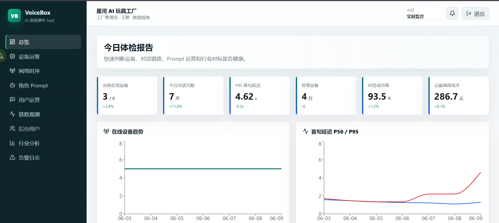

# Voice Box Dashboard

AI 语音硬件 ToB SaaS 控制台，覆盖租户管理、ESP32 设备运维、语音对话运营、后台用户管理、行业分析和告警日志。

## 界面展示

### 总览



### 租户管理


### 设备运维


### 网络时序


### 角色 Prompt


### 用户运营


### 链路观测


### 后台用户


### 行业分析


### 告警日志


## 技术栈

- Frontend: React + TypeScript + Vite
- Backend: Python FastAPI + SQLAlchemy + Alembic
- 数据库: PostgreSQL（已接入，含 seed 数据）
- 规划扩展: Redis + ClickHouse/TimescaleDB

## 启动数据库

```powershell
docker compose up -d
```

## 启动后端

```powershell
cd backend

python -m venv .venv
.venv\Scripts\Activate.ps1
pip install -r requirements.txt
copy .env.example .env
.\.venv\Scripts\alembic.exe upgrade head
python -m app.db.seed_runner
python -m app.db.seed_more_runner
python -m uvicorn app.main:app --reload --host 127.0.0.1 --port 8002
```

## 启动前端

```powershell
cd frontend
npm install
npm run dev
```

打开 http://localhost:5173

## 测试账号

- 平台管理员: `admin@voicebox.ai` / `123456`
- 工厂管理员: `factory-a@voicebox.ai` / `123456`
- 工程人员: `engineer@voicebox.ai` / `123456`

## 目前功能

- 登录与权限菜单
- 平台租户管理
- 后台用户管理
- 设备列表、SN 绑定、设备详情、网络时序数据
- AI 角色、结构化 Prompt、版本发布与回滚
- 对话记录、Badcase、ASR/LLM/TTS 延迟 Trace
- 行业匿名对标与优化建议
- 告警列表与处理

## 数据库

- 设计文档：[docs/database-design.md](docs/database-design.md)
- PostgreSQL DDL：[backend/db/schema.sql](backend/db/schema.sql)
- ORM 模型：`backend/app/models/`
- 数据访问层：`backend/app/repositories/`
- 迁移：`backend/alembic/`
- 初始化种子：`python -m app.db.seed_runner`

## 后续扩展

- TimescaleDB/ClickHouse: 大规模时序分析
- Redis: 在线设备状态、实时看板缓存
- MQTT/EMQX: ESP32 heartbeat, telemetry, conversation_trace 上报
